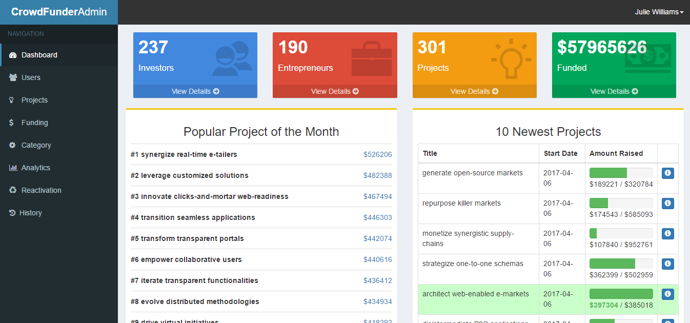

# Crowdfunder
Crowdfunding Database Web Application

 

* Project of the following module: CS2102 - Database Systems
* Implementation of SQL database design and concepts in creating a database application

Preloaded accounts for testing
 1. admin@admin.com
 2. user@user.com

 password = 'password'
